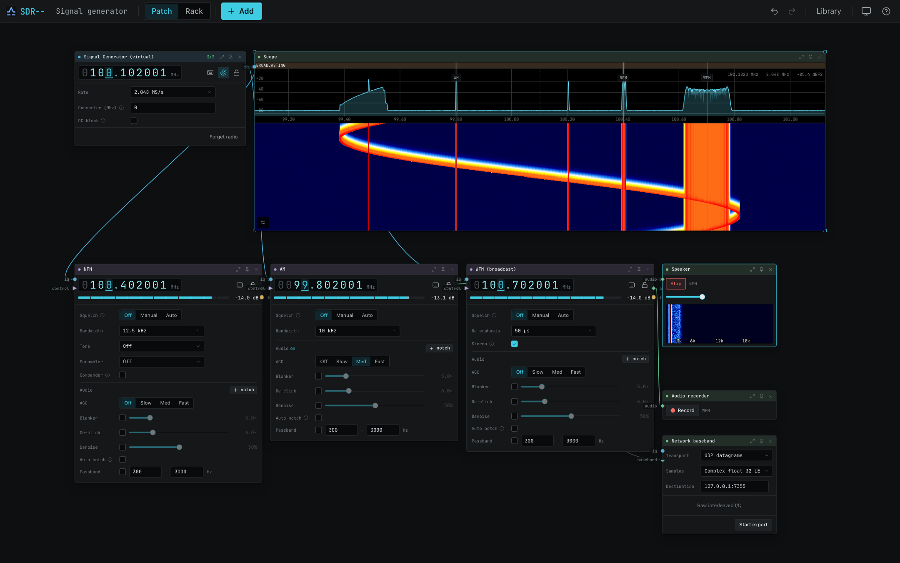
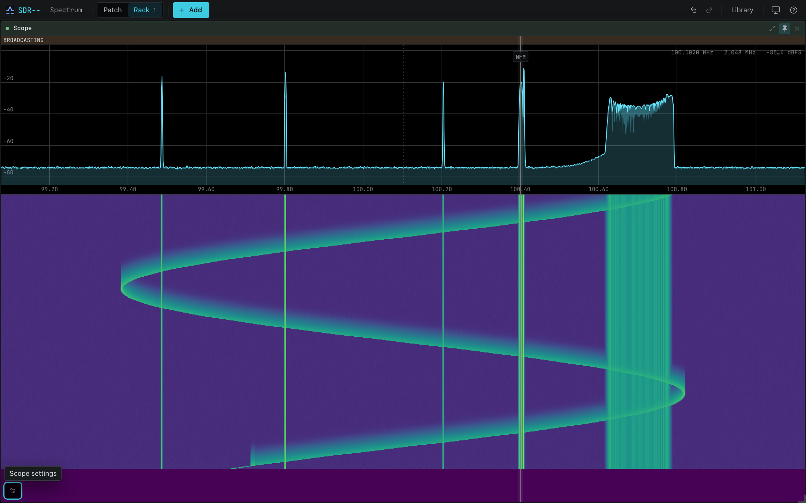
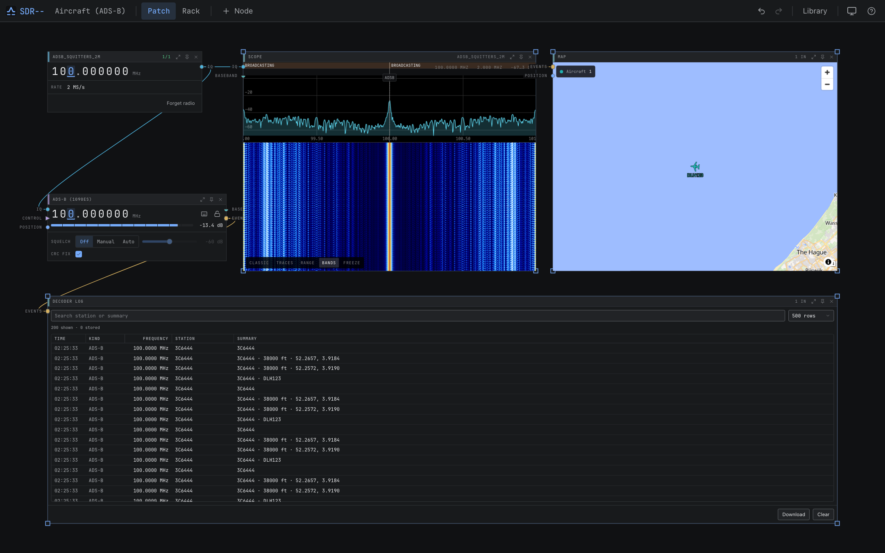
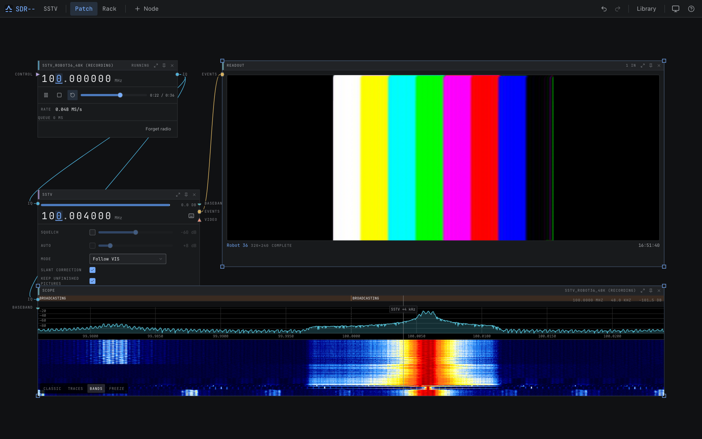
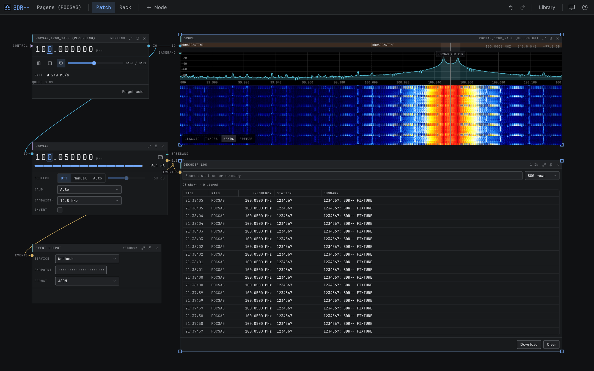

<p align="center">
  
</p>

# sdr--

A modular software-defined radio receiver for the desktop, the browser, and small remote servers.

sdr-- keeps radio hardware and real-time DSP in a Rust server while a React interface handles
tuning, visualization, and control. Run both together as a desktop app, serve the same interface
from a Raspberry Pi or home server, or connect directly to `rtl_tcp` and SpyServer receivers.

<p align="center">
  
</p>

## What it can do

- Build a receiver visually from device, channel, display, scanner, recorder, and output nodes.
- Listen to AM, narrowband FM, broadcast FM with RDS, and SSB.
- Decode ADS-B, AIS, APRS/AX.25, POCSAG, ACARS, NAVTEX, RTTY, PSK31–PSK250, Morse, CCIR/ZVEI/EEA
  selective calling, DCF77/WWVB/MSF/JJY radio clocks, educational GPS L1 C/A acquisition and NAV
  telemetry, sub-GHz frames, and several digital voice modes.
- Pull weak amateur traffic out of the noise with FT8, FT4, and WSPR.
- Follow DMR trunked systems: Capacity Plus, Hytera XPT, and Tier III. And keep every call as
  replayable audio.
- Identify an unknown signal from its bandwidth, symbol rate, and deviation, with ranked protocol
  candidates and the reason behind each one.
- Acquire DAB/DAB+, narrow-band DVB-S/S2 DATV, and DRM30/DRM+ carriers with lock, SNR, and
  frequency-error diagnostics.
- Receive SSTV in twelve scanning modes, watch each picture build up line by line, and keep every
  one that arrives in the server's picture store.
- Take bearings on a coherent array — a receiver that came with several lanes, or separate radios
  you wired to one clock — cross them from several stations, and drive to the transmitter with
  turn-by-turn navigation on a phone.
- Point the array's beam at what it found and listen to it, combine antennas for a few more dB, or
  null a local noise source against a reference antenna.
- Borrow a broadcast transmitter for passive radar: a range–Doppler surface, echoes followed from
  one integration to the next, and the ellipse each one could have come off drawn on the map.
- Display live spectrum and waterfall views, decoded readouts, position maps, band occupancy,
  logs, and ATV video.
- Scan frequency ranges, save workspaces, presets, and bookmarks, search regional band plans, and
  record IQ as SigMF, channel baseband, or audio for later playback.
- Rewind the last seconds of live reception, stream IQ or baseband to other software over UDP or
  TCP, and forward decoded traffic to any webhook, a Matrix room, or an MQTT broker.
- Sweep an antenna with a NanoVNA, size a new one with the antenna calculator, and take station
  position from a GPS or NMEA source.
- Automate the receiver through a typed REST API, WebSocket events, OpenAPI, or MCP.

The built-in signal generator means you can explore the complete receive path without owning an
SDR.

## Why not SDR++, SDRangel, or GQRX?

Those are good programs, and if you want a desktop receiver with a fixed layout and a long list of
demodulators, they will serve you better today — they are mature, and most of this project's
decoders are not yet (see below). sdr-- exists because four things are structural rather than
features that could be added to them:

- **The signal path is a graph you build, not a fixed chain.** Devices, channels, scopes, scanners,
  recorders, maps, logs, and network sinks are nodes you wire together. One device can feed twelve
  channels; one channel can feed a speaker, a map, a log, and a UDP sink at once. Two decoders can
  share a device while a third records the raw IQ underneath them. In a fixed layout each of those
  is a feature someone has to add; here it is a cable you drag.
- **The receiver and its interface are separate programs.** The Rust server owns the hardware and
  the DSP; the interface is a browser client. Put a Pi in the attic next to the antenna and operate
  it from the sofa, a laptop, or a phone — no X forwarding, no VNC, no remote desktop. The same
  build runs headless on the Pi and as a desktop app on your workstation, and several people can
  watch one receiver at the same time.
- **Everything the interface can do, a script can do.** The UI is a client of a typed REST API with
  a generated OpenAPI document, a WebSocket event stream, and an MCP server. Tuning, channels,
  scanning, recording, and decoded traffic are all reachable from a shell script, a bot, or an LLM
  agent, because they are the same endpoints the UI calls. There is no plugin to write and no
  separate automation surface that lags behind the app.
- **One binary, no module hunt.** RTL-SDR, HackRF, and SDRplay drivers are compiled in; so are the
  decoders and the web UI. `docker compose up` or a single downloaded file gets you a working
  receiver without installing SoapySDR modules, matching plugin ABIs, or tracking down which build
  of which library your distribution shipped.

The honest trade: sdr-- is younger and has less on-air mileage. If you need a proven receiver
right now, use SDR++. If you want a receiver you can wire up, put on the network, and drive from
code, that is what this is for.

## How far each mode has been proven

Everything above is implemented and covered by tests, but "tested" does not mean the same thing
for every mode. Each entry in the
[channel catalog](https://newspicel.github.io/sdrminusminus/user-guide/channels.html#channel-catalog)
carries one of three labels:

| Label | What it means |
|---|---|
| **tested on air** | Decoded from a real transmitter, with a capture of that signal committed as a regression test. |
| **fixture-only** | Decodes a golden IQ fixture rendered by sdr--'s own modulator, plus the worked examples the standard publishes. The frame layers are proven; the receiver has not been held against a real transmitter. |
| **experimental** | Acquisition, lock, or measurement only — no payload decoded — or a lab implementation rather than an operational one. |

Most decoders are fixture-only today. A fixture proves that the decoder undoes what our own
modulator did, which catches real bugs but says nothing about transmitter drift, keying
transients, adjacent-channel splatter, or multipath. Treat a fixture-only mode as a decoder that
should work rather than one that is known to. Off-air captures that promote a mode to *tested on
air* are among the most useful contributions the project can receive — see the
[contribution guide](CONTRIBUTING.md).

| | |
|---|---|
|  |  |
| Spectrum and waterfall, pinned to the rack | ADS-B aircraft on the map, with the decoder log |
|  |  |
| A Robot 36 SSTV picture, scanned out line by line | POCSAG pager messages as they arrive |

## Get started

Download the desktop installer or portable server for your platform from
[GitHub Releases](https://github.com/Newspicel/sdrminusminus/releases). Nightly builds are
available from the rolling [nightly release](https://github.com/Newspicel/sdrminusminus/releases/tag/nightly).

### Homebrew

```sh
brew trust newspicel/tap
brew tap newspicel/tap
brew install sdrminusminus
brew install sdrmm
```

### Docker

To try the server with Docker:

```sh
docker compose up -d
```

Open <http://localhost:8080>. In the starter workspace, choose **Signal Generator (virtual)** on
the Device node. The existing Scope will immediately show synthetic signals. Add an NFM channel,
wire the Device's IQ output to it, wire its audio output to the Speaker, and tune the channel to
`+300 kHz` for a 1 kHz test tone.

For a real receiver, choose it instead of the signal generator. RTL-SDR, HackRF and SDRplay RSP
receivers have built-in drivers and need no SoapySDR module. SDRplay is the one exception that
needs SDRplay's own API installed, because its licence covers use with genuine SDRplay hardware
rather than redistribution. Desktop installers and containers additionally bundle SoapySDR support
for Airspy/AirspyHF, bladeRF, LimeSDR, PlutoSDR, and SoapyRemote. See the
[hardware guide](https://newspicel.github.io/sdrminusminus/hardware.html) for setup and USB
troubleshooting.

## Build from source

You need the pinned Rust toolchain, a C/C++ compiler, CMake, Node 26, pnpm 11, and SoapySDR 0.8
development files. On Debian or Ubuntu, install `build-essential cmake libsoapysdr-dev`; on macOS,
run `xcode-select --install` and `brew install cmake soapysdr`.

```sh
git clone https://github.com/Newspicel/sdrminusminus.git
cd sdrminusminus
pnpm --dir web install --frozen-lockfile
pnpm --dir web build
cargo run -p sdrmm
```

Then open <http://localhost:8080>. For development, `cargo xtask dev` runs the Rust server and a
Vite dev server with hot reload at <http://localhost:5173>; add `--watch` to also restart the Rust
server when backend inputs change.

A virtual and network-only build does not require SoapySDR:

```sh
cargo run -p sdrmm --no-default-features --features net-client
```

## Project layout

| Path | Purpose |
|---|---|
| `apps/sdrmm` | Headless server binary with the web UI embedded |
| `apps/desktop` | Tauri desktop shell around the same server and UI |
| `crates/engine` | Real-time device, DSP, channel, scanner, and recording orchestration |
| `crates/channels` | Demodulators and protocol decoders |
| `crates/device-*` | SoapySDR, network, and virtual device backends |
| `crates/wire` | Shared REST, WebSocket, settings, and generated-client types |
| `crates/server` | HTTP, WebSocket, MCP, persistence, and embedded frontend |
| `web` | React application |
| `docs` | mdBook documentation |

## Development commands

`cargo xtask` is the local entry point for the same gates used in CI.

| Command | Purpose |
|---|---|
| `cargo xtask dev` | Run the server and frontend dev server (`--watch` restarts the server on backend changes) |
| `cargo xtask check` | Format, lint, type-check, build, and check generated-code drift |
| `cargo xtask test` | Run Rust and frontend tests without real hardware |
| `cargo xtask smoke` | Run the Playwright flow against the real server binary |
| `cargo xtask screenshots` | Regenerate `assets/screenshots` from the fixture library |
| `cargo xtask codegen` | Regenerate OpenAPI and TypeScript API types |
| `cargo xtask audit` | Check dependencies with `cargo-deny` |
| `cargo xtask fixtures` | Regenerate synthesized decoder fixtures |
| `cargo xtask licenses` | Regenerate third-party notices |
| `cargo xtask dist` | Build a portable server archive for the current target |
| `cargo xtask desktop` | Check or bundle the Tauri desktop app |

See the [development guide](https://newspicel.github.io/sdrminusminus/development/building.html)
for prerequisites, architecture, testing, and release workflows.

## Documentation and API

- [User and developer guide](https://newspicel.github.io/sdrminusminus/)
- [Contribution guide](CONTRIBUTING.md)
- [Feature roadmap](FEATURES.md)
- Swagger UI at `/api/docs` on any running server
- Generated OpenAPI document at `/api/openapi.json` or [in the repository](openapi.json)

## License

Copyright (C) 2026 sdr-- contributors.

sdr-- is free software licensed under the [GNU General Public License, version 3 or
later](LICENSE). Distributed dependencies and bundled hardware components are documented in
[THIRD_PARTY_NOTICES.md](THIRD_PARTY_NOTICES.md); their complete license texts are also available
from the app's About panel.
