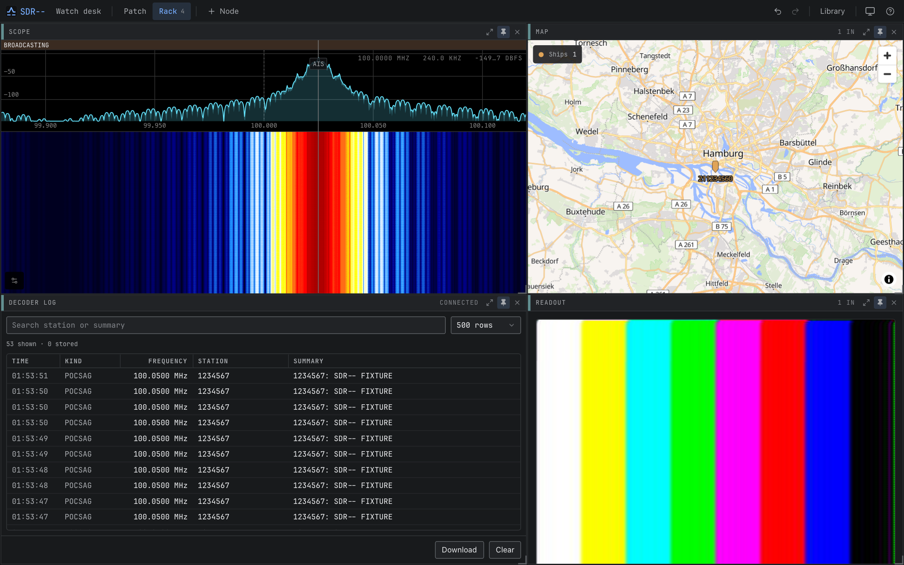
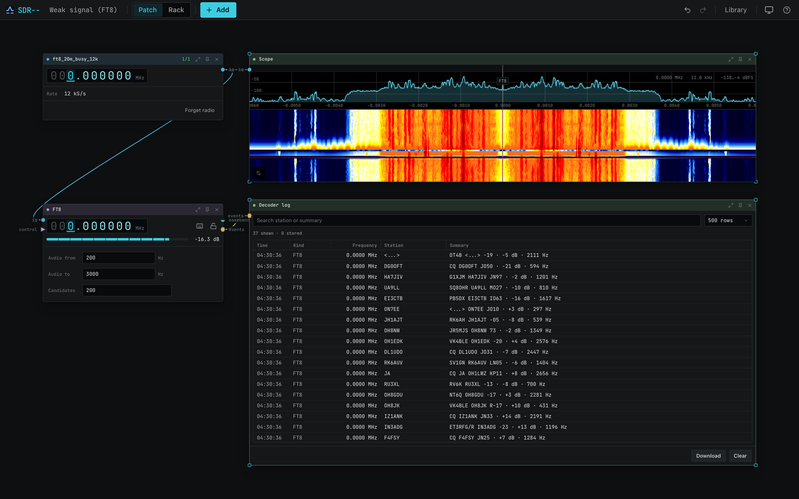
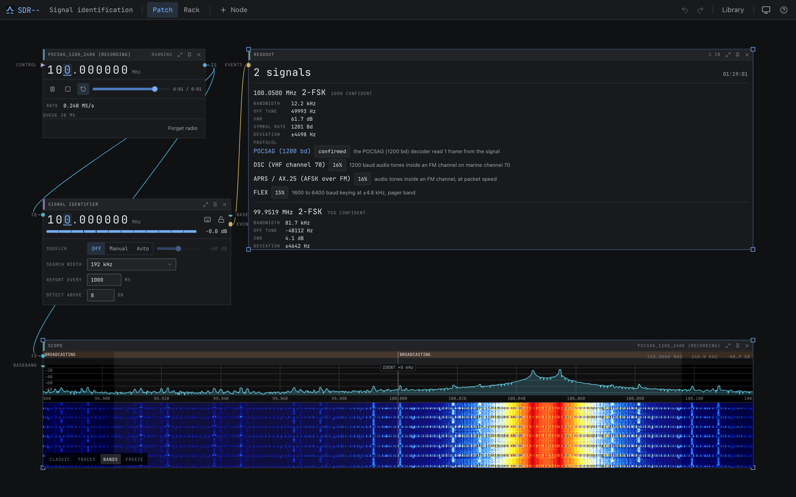
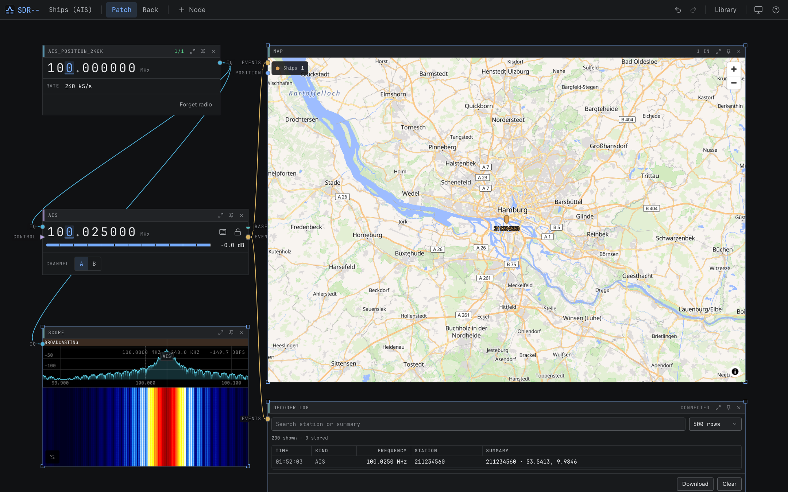
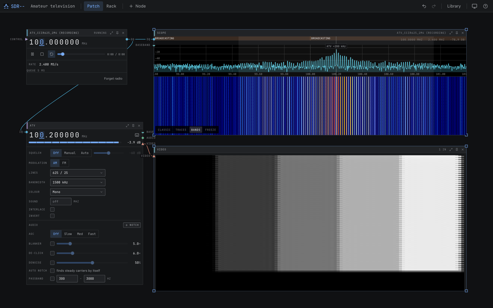
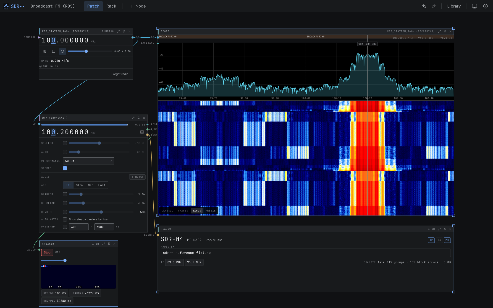

<p align="center">
  
</p>

# sdr--

sdr-- is a software-defined radio application with a visual signal path. Connect devices,
decoders, displays, and recorders on a canvas, then pin the controls you use to a rack.

A Rust server handles the radio and signal processing. The React interface runs in a desktop
window or browser. You can run both on one computer, or leave the server beside the antenna and
connect over the network. A built-in signal generator lets you try it without an SDR.

<p align="center">
  
</p>

## Status

sdr-- is under active development. Most decoders have been tested with generated IQ fixtures;
only some have been verified on air. The [channel catalog](https://newspicel.github.io/sdrminusminus/user-guide/channels.html#channel-catalog)
lists the evidence for each mode and its limitations. Experimental modes may provide acquisition
or measurements without decoded audio or video.

## What you can do

- Listen to AM, NFM, broadcast FM with stereo and RDS, SSB, and supported digital voice modes.
- Decode aircraft, ship, amateur, pager, sensor, and other radio traffic. See the
  [full channel list](https://newspicel.github.io/sdrminusminus/user-guide/channels.html).
- View spectrum, waterfalls, decoded messages, position maps, and received images.
- Scan frequencies and save workspaces, presets, and bookmarks.
- Record device IQ, channel baseband, or audio; replay IQ through the same decoders.
- Use coherent receivers for direction finding, antenna combining, beamforming, and passive radar.
- Export IQ over UDP or TCP and forward decoded events to webhooks, Matrix, or MQTT.
- Control the running receiver through REST, WebSocket, or MCP.

## Install

Download a desktop installer or portable server from
[GitHub Releases](https://github.com/Newspicel/sdrminusminus/releases).
[Installation instructions](https://newspicel.github.io/sdrminusminus/getting-started/install.html)
cover each package, Homebrew, Nix, and containers.

On macOS, install the desktop app with Homebrew:

```sh
brew tap newspicel/tap
brew install --cask sdrminusminus
```

For the headless server, use `brew install sdrmm`.

To run the server with Docker Compose on Linux:

```sh
git clone https://github.com/Newspicel/sdrminusminus.git
cd sdrminusminus
docker compose up -d
```

Open <http://localhost:8080>. The server has no authentication by default; see
[configuration and security](https://newspicel.github.io/sdrminusminus/server/configuration.html)
when setting up network access.

## Try a receiver

1. On the starter **Device** node, choose **Signal Generator (virtual)**. The connected Scope
   shows the generated signals.
2. Choose **+ Node** and add an **NFM** channel.
3. Connect Device `IQ` to NFM `IQ`, then NFM `audio` to Speaker `audio`.
4. Set the channel offset to `+300 kHz` and start audio on the Speaker. You should hear a 1 kHz tone.

[Your first receiver](https://newspicel.github.io/sdrminusminus/getting-started/first-receiver.html)
walks through the controls and switching to hardware.

Standard builds include native RTL-SDR, HackRF, SDRplay, and CR-8 drivers. SDRplay and CR-8 also
require their vendor libraries. Desktop installers and containers bundle SoapySDR modules for
Airspy/AirspyHF, bladeRF, LimeSDR, PlutoSDR, and SoapyRemote. See the
[hardware guide](https://newspicel.github.io/sdrminusminus/hardware.html) for requirements.

## Screenshots

These captures use the built-in signal generator or repository IQ fixtures. Regenerate them with
`cargo xtask screenshots`.

| Spectrum and waterfall | Rack view |
|---|---|
|  |  |

| FT8 decoding | Signal identification |
|---|---|
|  |  |

| Aircraft positions | Ship positions |
|---|---|
|  |  |

| Slow-scan television | Amateur television |
|---|---|
|  |  |

| Pager messages | Broadcast FM |
|---|---|
|  |  |

## Build from source

You need the repository's pinned Rust toolchain, a C/C++ compiler, CMake, Node 26, pnpm 11, and
SoapySDR 0.8 development files. The [build guide](https://newspicel.github.io/sdrminusminus/development/building.html)
lists platform prerequisites.

```sh
git clone https://github.com/Newspicel/sdrminusminus.git
cd sdrminusminus
pnpm --dir web install --frozen-lockfile
pnpm --dir web build
cargo run -p sdrmm
```

Open <http://localhost:8080>. For development, `cargo xtask dev` starts the server and a frontend
with hot reload at <http://localhost:5173>. Add `--watch` to restart the backend when its files
change.

To build with only virtual sources and network receivers:

```sh
cargo run -p sdrmm --no-default-features --features net-client
```

## Development

| Path | Purpose |
|---|---|
| `apps/sdrmm` | Headless server binary |
| `apps/desktop` | Tauri desktop shell |
| `crates/dsp`, `crates/modem` | Signal-processing primitives and reusable modem algorithms |
| `crates/engine` | Device and signal-processing orchestration |
| `crates/channels` | Demodulators and protocol decoders |
| `crates/device-*` | Native, SoapySDR, network, virtual, and array backends |
| `crates/wire` | Shared API, WebSocket, and settings types |
| `crates/server` | HTTP, WebSocket, MCP, persistence, and embedded frontend |
| `web` | React application |
| `docs` | mdBook documentation |

| Command | Purpose |
|---|---|
| `cargo xtask check` | Format, lint, type-check, build, and check generated-code drift |
| `cargo xtask test` | Run Rust and frontend tests without hardware |
| `cargo xtask smoke` | Run the browser test against the server |
| `cargo xtask codegen` | Regenerate OpenAPI and TypeScript API types |
| `cargo xtask audit` | Check dependencies with cargo-deny |

See [Contributing](CONTRIBUTING.md) and the
[development guide](https://newspicel.github.io/sdrminusminus/development/building.html)
for testing, generated files, and releases.

## Documentation and API

- [User and developer guide](https://newspicel.github.io/sdrminusminus/)
- Swagger UI: `/api/docs` on a running server
- OpenAPI: `/api/openapi.json` or the checked-in [openapi.json](openapi.json)

## License

Copyright (C) 2026 sdr-- contributors.

sdr-- is licensed under the [GNU General Public License, version 3 or later](LICENSE).
[THIRD_PARTY_NOTICES.md](THIRD_PARTY_NOTICES.md) lists distributed dependencies and bundled
hardware components. Their license texts are also available in the app's About panel.
