<p align="center">
  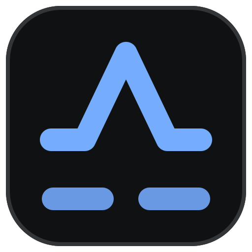
</p>

# SDR--

A software-defined radio application for listening, decoding, and recording. Connect radios,
channels, and displays in **Patch** view, then pin your everyday controls to **Rack** view.

Run the desktop app with a local SDR, or place the server near your antenna and connect through
a browser. Both use the same receiver engine and interface.

Questions or ideas? Join the [Discord](https://discord.gg/dYaRyGwBNw).

<p align="center">
  <picture>
    <source media="(prefers-color-scheme: light)" srcset="assets/screenshots/patch-light.png">
    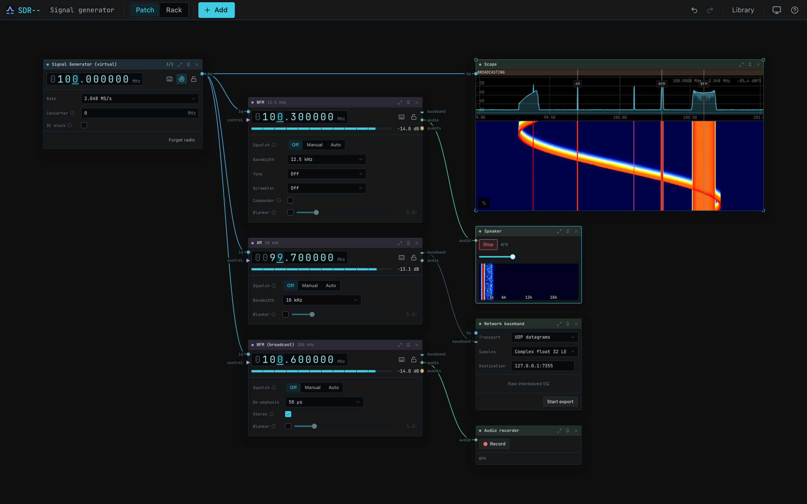
  </picture>
</p>

## Install

Download a desktop installer or portable server from
[GitHub Releases](https://github.com/Newspicel/sdrmm/releases).
The [installation guide](https://sdrmm.com/docs/getting-started/install)
covers macOS, Windows, Linux, Homebrew, APT, DNF, Nix, and Docker.

For a headless server on macOS or Linux, install `sdrmm` from Homebrew core:

```sh
brew install sdrmm
brew services start sdrmm
```

Open <http://localhost:8080>. For remote access, configure
[authentication and HTTPS](https://sdrmm.com/docs/server/configuration).

## Start with an RTL-SDR

1. Plug in the RTL-SDR and pick it on the **Device** node. Set the rate to **2.4 MS/s**.
2. Add a **WFM** channel from **+ Node** and set it to a local FM station.
3. Wire Device `iq` to WFM `iq`, and WFM `audio` to the Speaker.
4. Start the Speaker. Press `p` on a node to pin it to the Rack.

[Your first receiver](https://sdrmm.com/docs/getting-started/first-receiver) walks
through it. [Radios](https://sdrmm.com/docs/hardware) covers other hardware.

## What it supports

- **Listening:** AM, NFM, broadcast FM with stereo and RDS, SSB, and digital voice.
- **Decoding:** aircraft, ships, amateur radio, pagers, sensors, images, and more.
- **Displays:** spectrum, waterfalls, maps, decoded messages, and video.
- **Recording:** device IQ, channel baseband, and audio, with SigMF playback.
- **Radio tools:** scanning, signal identification, coherent arrays, direction finding, and passive radar.
- **Automation:** REST, WebSocket, MCP, network IQ export, and event forwarding.

SDR-- is under active development. The
[decoder catalog](https://sdrmm.com/docs/user-guide/decoders#catalog) shows how well
each mode is tested.

## Screenshots

These captures use debug-build signal sources and repository IQ fixtures. Regenerate them with
`cargo xtask screenshots`.

<table>
<tr><th width="50%">Spectrum and waterfall</th><th width="50%">Rack view</th></tr>
<tr><td><picture><source media="(prefers-color-scheme: light)" srcset="assets/screenshots/spectrum-light.png">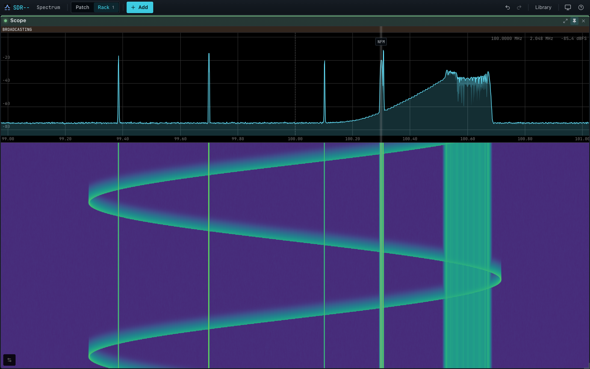</picture></td><td><picture><source media="(prefers-color-scheme: light)" srcset="assets/screenshots/rack-light.png">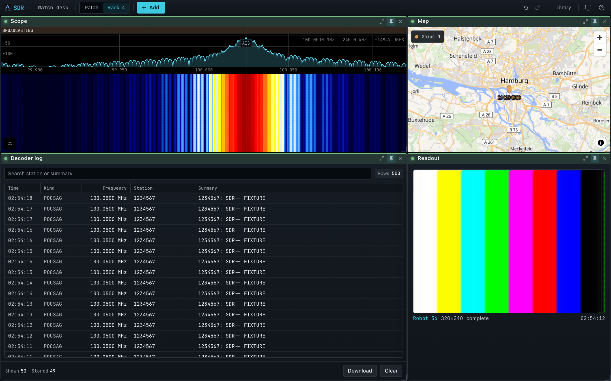</picture></td></tr>
<tr><th width="50%">FT8 decoding</th><th width="50%">Signal identification</th></tr>
<tr><td><picture><source media="(prefers-color-scheme: light)" srcset="assets/screenshots/ft8-light.png">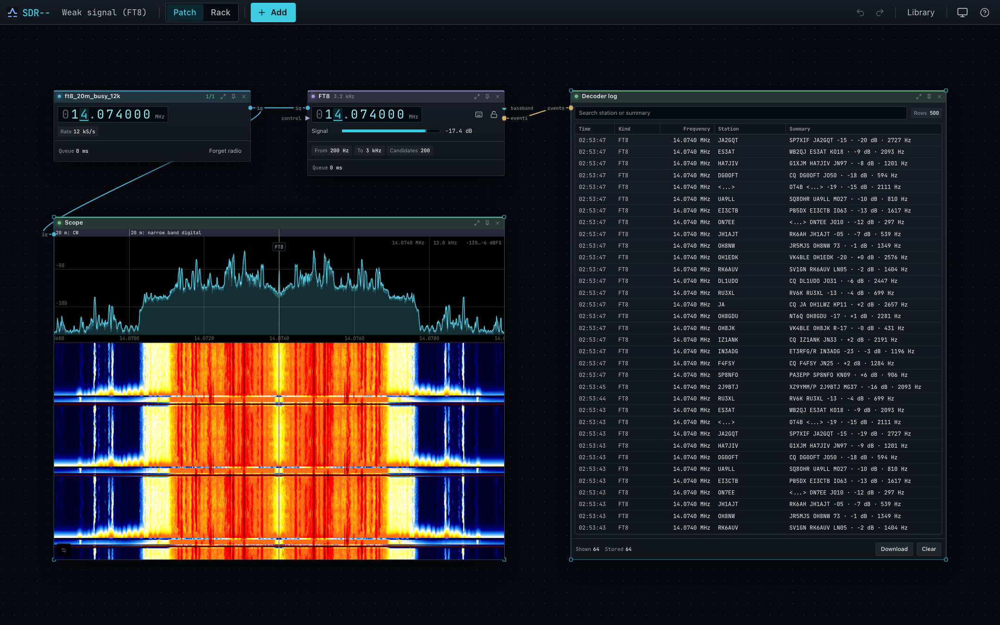</picture></td><td><picture><source media="(prefers-color-scheme: light)" srcset="assets/screenshots/ident-light.png">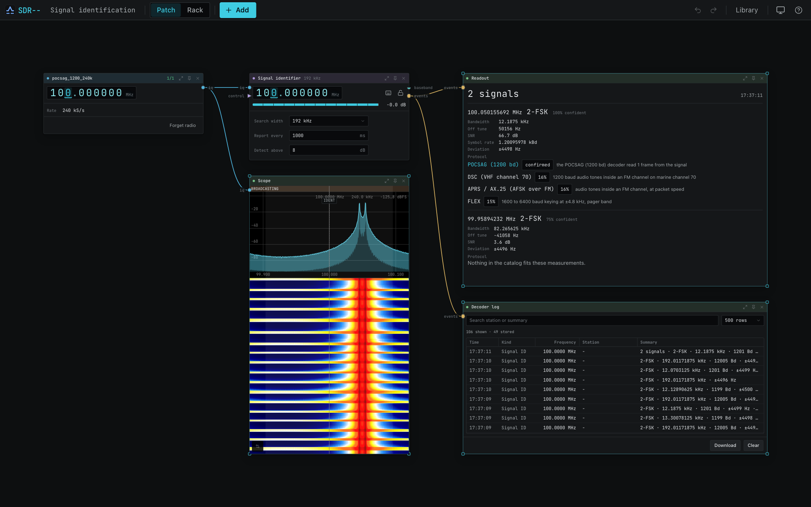</picture></td></tr>
<tr><th width="50%">Aircraft positions</th><th width="50%">Ship positions</th></tr>
<tr><td><picture><source media="(prefers-color-scheme: light)" srcset="assets/screenshots/adsb-light.png">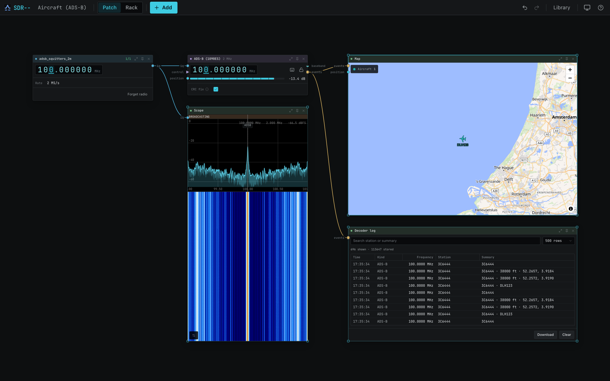</picture></td><td><picture><source media="(prefers-color-scheme: light)" srcset="assets/screenshots/ais-light.png">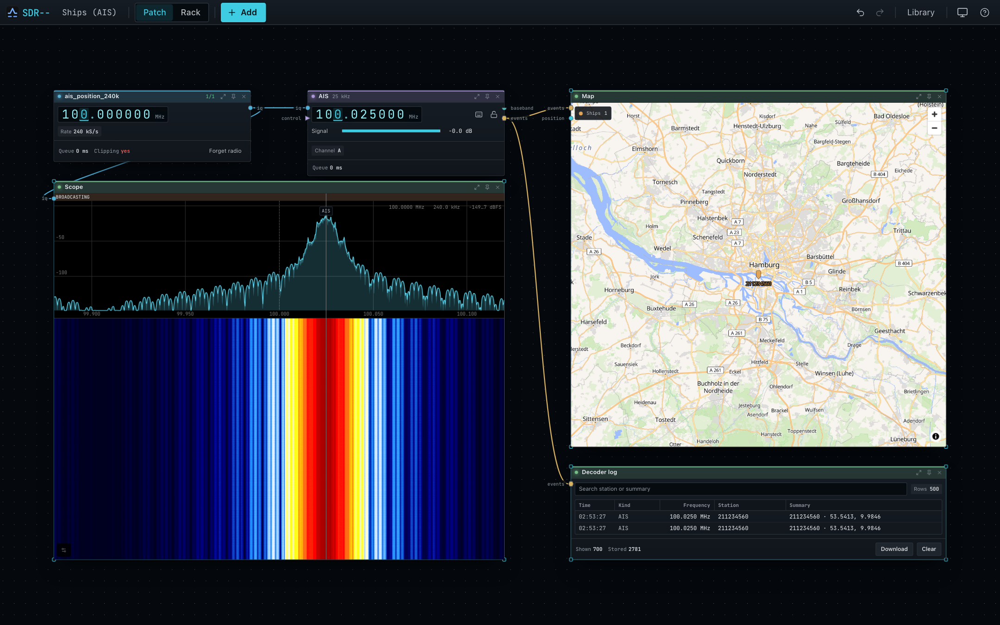</picture></td></tr>
<tr><th width="50%">Slow-scan television</th><th width="50%">Amateur television</th></tr>
<tr><td><picture><source media="(prefers-color-scheme: light)" srcset="assets/screenshots/sstv-light.png">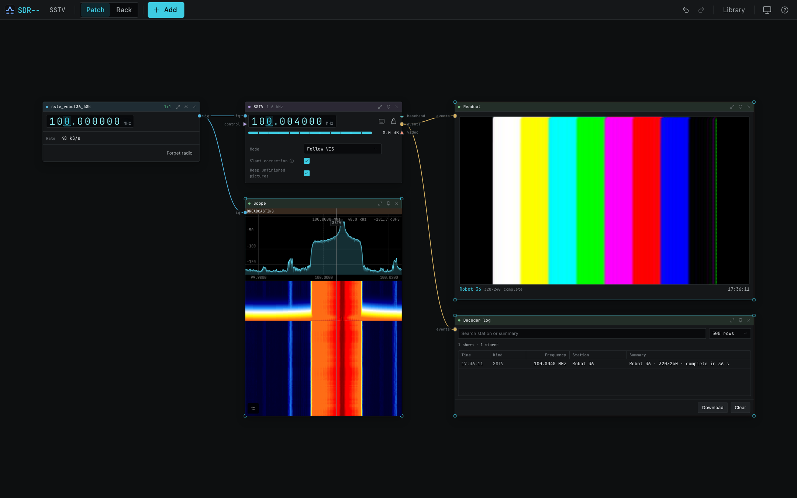</picture></td><td><picture><source media="(prefers-color-scheme: light)" srcset="assets/screenshots/atv-light.png">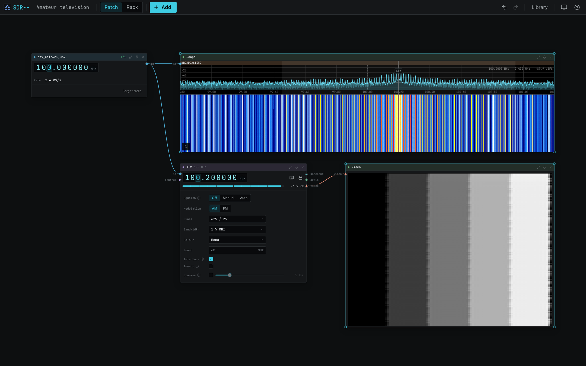</picture></td></tr>
<tr><th width="50%">Pager messages</th><th width="50%">Broadcast FM</th></tr>
<tr><td><picture><source media="(prefers-color-scheme: light)" srcset="assets/screenshots/pocsag-light.png">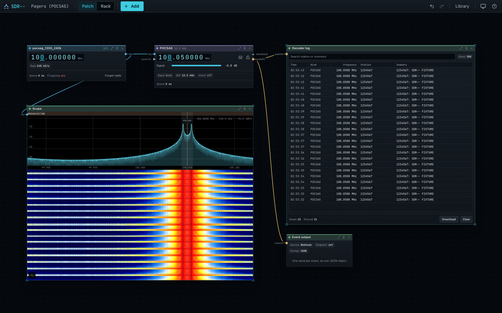</picture></td><td><picture><source media="(prefers-color-scheme: light)" srcset="assets/screenshots/rds-light.png">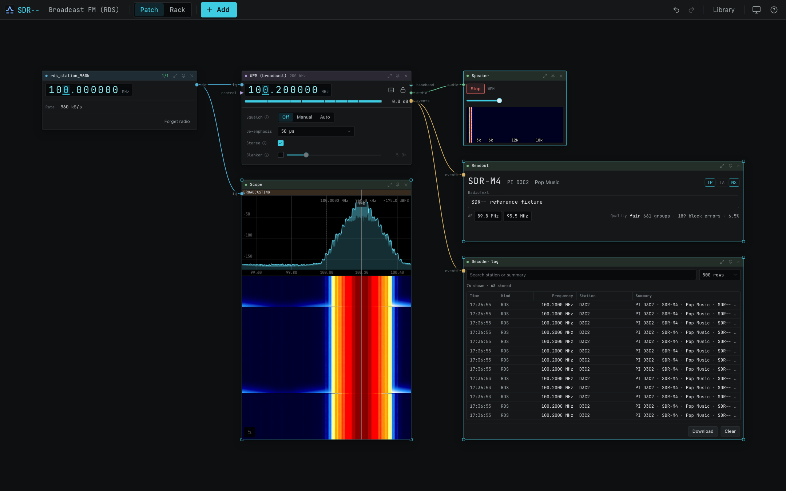</picture></td></tr>
</table>

## Build

```sh
git clone https://github.com/Newspicel/sdrmm.git
cd sdrmm
python3 scripts/build-media.py
export FFMPEG_DIR="$(python3 scripts/build-media.py --print-prefix)"
pnpm --dir web install --frozen-lockfile
pnpm --dir web build
cargo run -p sdrmm
```

Open <http://localhost:8080>, or run `cargo xtask dev --watch` and open <http://localhost:5173>
for hot reload. `cargo xtask check` and `cargo xtask test` are the main gates.

The [build guide](https://sdrmm.com/docs/development/building) lists prerequisites and
every check.

## Documentation and API

- [User and developer guide](https://sdrmm.com/docs/)
- Swagger UI: `/api/docs` on a running server
- OpenAPI: `/api/openapi.json` or [openapi.json](openapi.json)

## Thanks

[KrakenRF](https://www.krakenrf.com), [Airspy](https://airspy.com) and
[AntSDR](https://www.microphase.cn/) provided hardware for development and testing.

Making a radio? Write to [hi@jhaag.me](mailto:hi@jhaag.me) to get it supported and tested.

## License

Copyright (C) 2026 Julian Haag.

Licensed under the [GNU Affero General Public License, version 3 or later](LICENSE).
Need a commercial license or custom work? Write to [hi@jhaag.me](mailto:hi@jhaag.me).
[Third-party notices](THIRD_PARTY_NOTICES.md) and license texts are also available in the app's
About panel.
